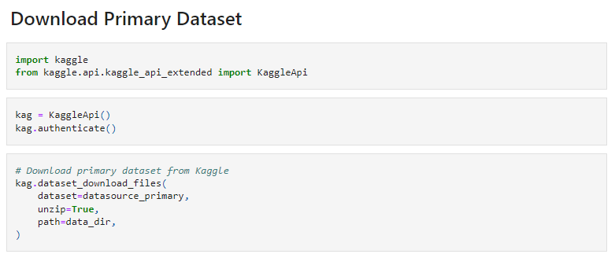
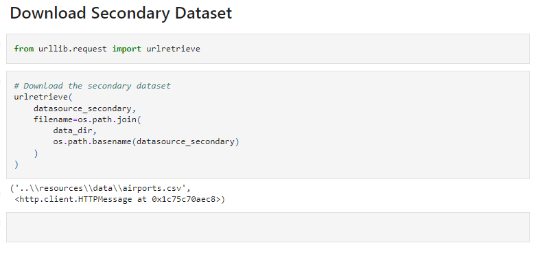

# To_fly_or_not_to_fly

## Purpose
This README will serve as a project/presentation outline as we work, and as a guide once the project is complete.

## The Story
Delayed or cancelled flights can ruin business trips, vacations, family events, and so much more. But what if you could predict whether or not a flight will be cancelled before you even arrive at the airport? You could change your plans, find another way to get to your destination, call in on Zoom. The possibilities are endless.

Flight cancellations don't just impact travelers, but can mean loss in profits for airlines. Having an accurate estimation of fight cancellations is critical for airlines in order to increase both customer satisfaction and overall profit.

We wanted to make this a reality, so we decided to take a look at flights that have been cancelled due to weather in order to determine the likelihood of a flight being cancelled based on specific combinations of weather events. We also hope to look at other features such as the location of an airport, the flight's airline, and even possibily time of departure.

Questions:
How does weather impact flight cancellations? Are there certain weather events (snow, raing, wind, etc.) that impact the decision to cancel at a higher rate than other weather events?
Are certain airlines more prone to cancelling flights based on weather?

## The team
We are a team of four, from various backgrounds, coming together to answer this question with our knowledge of databases, data cleaning, machine learning, and analysis.

### Communication
We are using Slack as our primary means of communication, and have created a channel for us to collaborate. We communicate our progress, ask each other questions, and share our thoughts as we move through each piece of the project.

We also have a Google Doc where we can collaborate and take notes from our meetings. This is where we are placing action items. 

We are meeting regularly on Monday and Wednesday from 7-9 PM, and as-needed at other times.

In case of emergency, we will reach out to each other on Slack. We have also shared our contact information in the shared Google Doc.

## The data
### Where did the data come from?
The primary data for this project comes from a [Kaggle dataset](https://www.kaggle.com/datasets/ioanagheorghiu/historical-flight-and-weather-data) of millions of flight cancellations, the reason for the cancellation, and weather data from May through December of 2019. The data was accessed and downloaded with the use of Kaggle's API. This data was originally sourced from the UNited States Bureau of Transportation Statistics and the National Oceanic Atmospheric Administration.

The secondary dataset for this project comes from [The Global Airport Database](https://www.partow.net/miscellaneous/airportdatabase/index.html) and includes latitude and longitude data for airports in the US. This will be joined to the primary dataset using PostgreSQL. 

The discovery proces included researching Weather APIs, historical weather datasets, airport location datasets, and flight delay datasets.

### What will we do with the data?
The primary data was downloaded using the Kaggle API, and code written in Jupyter Notebook. 

The seconday dataset was downloaded by importing urlretrieve from urllib.request in Jupyter Notebook.

Once downloaded, the data was cleaned and processed using Python in Jupyter Notebook.

## The process
### Choosing the Machine Learning Model
We will implement a machine learning model in Python. We will use Scikit-learn, a Python machine learning library. We will use supervised machine learning to perform tasks such as learning from data patterns and making predictions. Supervised Learning will help to predict, based on the airport location and the weather conditions whether a flight will be delayed or not. We will also explore whether certain airlines cancel flights at a higher rate than others.

The two main uses of supervised learning: regression and classification. In the first part of the project, we look at using Python based Logistic Regression along with Support Vector Machine and then plugging the dataset into our classifier for results. Logistic regression was chosen to model flight delay for multiple reasons. First, the weights of each feature trained by logistic regression are easily interpretable, as the sign of the weight indicates if a flight is more or less likely to be delayed if it has a high value for that feature. Second, logistic regression outputs a measure of confidence in its output through the probability of belonging to each class.

## The results
### Presentation
The final presentation of our exploration and analysis will include an interactive map created with D3 and Leaflet. This map will show the locations of airports, and we hope to have the size of the marker indicate the frequency of cancellations due to weather. We will also include a Google slide presentation to share our background, process, and results.
Outputs...
Analysis...

## Next steps
What we do with the information...
Possibilities for improvement...
Possible uses...

## Tools used 
Python (with dependencies scikit-learn, urllib, pandas, ...)
PostgreSQL
Jupyter Notebook
Kaggle, Kaggle API
D3
Leaflet
Github
Google Slides

