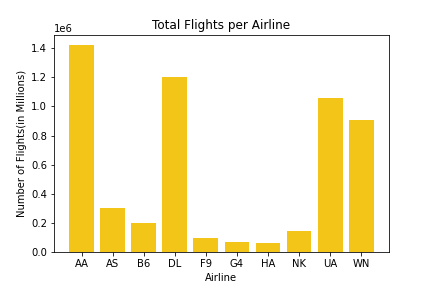
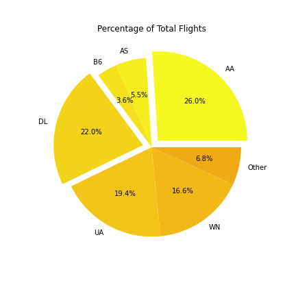
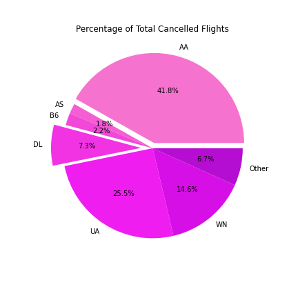

# To Fly or Not to Fly

## Story / Purpose
Delayed or cancelled flights can ruin business trips, vacations, family events, and so much more.

Flight cancellations don't just impact travelers. They can also lead to lost revenue for airlines. Having an accurate estimation of fight cancellations is critical for airlines in order to increase both customer satisfaction and overall profit.

But what if you could predict whether or not a flight would be cancelled before you even arrive at the airport? You could change your plans, find another way to get to your destination, call in on Zoom… the possibilities are endless.

We wanted to make this a reality, so we decided to take a look at flights that have been cancelled due to weather in order to determine the likelihood of a flight being cancelled based on specific combinations of weather events. We also hoped to look at other features such as airport location, airline, and possibily departure time.

**Note:** The Google Slides presentation for this project is located [here](https://docs.google.com/presentation/d/1xCQfsnr2x7BBR7qA2yhjTOwE3UHtH0NpNxat9xTnOas/edit#slide=id.g1538de35a1e_0_25").

### Questions

- How does weather impact flight cancellations?
- Are there certain weather events (snow, rain, wind, *etc.*) impact the decision to cancel flights at a higher rate than other weather events?
- Are certain airlines more prone than others to cancelling flights based on weather?

## The Team
We are a team of four, from various backgrounds, coming together to answer this question using our knowledge of databases, data cleaning, machine learning, and analysis.

## The Data

### Where did the data come from?

The discovery process included researching Weather APIs, historical weather datasets, airport location datasets, and flight delay datasets. Eventually, we settled on two datasets:

#### Flights and Weather Data

The primary data for this project comes from [a Kaggle dataset](https://www.kaggle.com/datasets/ioanagheorghiu/historical-flight-and-weather-data) of millions of flight cancellations, the reason for the cancellation, and weather data, all from May through December of 2019. The data was accessed and downloaded with the use of Kaggle's API and was originally sourced from the [United States Bureau of Transportation Statistics](https://www.bts.gov/browse-statistical-products-and-data/bts-publications/airline-service-quality-performance-234-time) and the [National Oceanic and Atmospheric Administration](https://www.ncdc.noaa.gov/cdo-web/datatools/lcd).

The data was downloaded using code written in Jupyter Notebook and employing the Kaggle API. 


#### Airports Data

The secondary dataset for this project comes from [The Global Airport Database](https://www.partow.net/miscellaneous/airportdatabase/index.html) and includes latitude and longitude data for more than nine thousand airports.

The data was downloaded in Jupyter Notebook with the following code.


### What did we do with the data?

Once downloaded, the data was cleaned and processed using Python and Pandas in Jupyter Notebook and was uploaded to a PostgreSQL database. From there, it could be extracted using standard PostgreSQL `SELECT` and `JOIN` syntax and either saved to a CSV file or loaded directly into a single, combined Pandas dataframe.

## The Process

### Data Preprocessing

#### Airport Data

##### General Text Conversion

The airport data required a lot of general text conversion, including: splitting, joining, regular expression substitution, and null-value conversion (to Python `None` values).

##### Column Definitions

In addition, there were issues related to column definitions that had to be resolved before the SQL database would accept the data.

**Problem:** NumPy `NaN` values are technically `float`s, which, if present, cause Pandas to coerce otherwise-`integer` columns into `float` columns.

**Solution:** convert such columns to Pandas `Int64Dtype`, whose `<NA>` values still count as `integer`s.

**Problem:** IATA codes are supposed to be unique. However, the `iata_code` column included some duplicates, which were most likely errors. Unfortunately, there is no publically available, canonical and comprehensive list of ICAO and IATA airport codes (that we were able to find), so we had to choose which rows to keep or drop.

**Solution:** For rows with duplicate IATA codes
- programmatically remove rows that contain no coordinate information
- of the rows that remained, manually choose which to keep and which to drop, using the following inclusion/exclusion guidelines:
  - If the rows contain similar data, but one has `NULL` values and the other doesn't, drop the row with `NULL` values.
  - If the same code specifies both an international airport and a smaller airfield in the same general vicinity, keep the international airport.
  - If the rows seem to be describing the same airport, but one has a more specific name than the other, keep the one with the more specific name.

#### Flights and Weather Data

##### Column Name Letter Case

PostgreSQL uses only lowercase column names, so the columns in the dataframe had to be made lowercase.

##### Redundant Data

The data contained both a `date` column as well as individual `year`, `month`, `day`, and `weekday` columns, all of which can be extracted from `date`, as long as they are in full agreement.

Analysis of the columns' data did show full agreement, and so `year`, `month`, `day`, and `weekday` were dropped.

##### Irrelevant Cancellations

Flights can be cancelled for many reasons. For this project, only weather-based cancellations were important. So flights with non-weather-based cancellations were dropped.

##### Incorrect Data Types

Once only two types of cancellations remained—"cancelled due to weather" or "not cancelled"—we converted the `cancelled_code` column into a `boolean` `cancelled` column.

##### Foreign Key Constraints

We intended to use the IATA codes in the flights-and-weather data to join to the corresponding column in the airports data. However, we discovered that the airports data is not comprehensive, and so we had to remove the `FOREIGN KEY CONSTRAINT` from the PostgreSQL database to allow the flights-and-weather data to upload.

This does mean that some data extracted from the database using an (outer) join on these columns will have `NULL` values, but we decided it was better to have the data and ignore it than it was to discard it and later discover we needed it.

### Choosing the Machine Learning Model

#### Initial Choice

We implemented a machine learning model in Python using Scikit-learn, a Python machine-learning library.

We used supervised machine learning to perform tasks such as learning from data patterns and making predictions. Supervised Learning helps to predict—based on airport location and weather conditions—whether a flight will be delayed or not.

The two main uses of supervised learning are regression and classification. In the first part of the project, we used logistic regression to classify our results. Logistic regression was chosen to model flight delay for multiple reasons: first, the results of logistic regression are easily interpretable, since it is a binary classifier; second, it has a built-in "confidence" measure, since the magnitudes of the weights indicate how strongly the model believes flights are to be cancelled.

#### Change of Model Choice

For later trials, we instead chose to implement a random forest mode.

Logistic regression attempts to predict outcomes based on a set of independent variables, but if we include the wrong independent variables, the model will have little-to-no predictive value. We also had to rethink the question: is there any other factor that may impact the model.

We switched to a random forest model to improve our prediction result. This is an ensemble technique which can be used both for regression and for classification tasks. It creates multiple decision tress using a technique called bagging, which involves training all the decision trees on different data samples. The final prediction is made by combining the results of all the decision trees rather than just relying on one of them.

The random forest model showed an improvement in the accuracy score from 72% to 87%, and eventually to 99%!

After building and training the model, predictions were made using the predict method. We used `ConfusionMatrix` to check the results.

#### Overfitting Concerns

We do have some concern about whether the random forest model might be overfit. One advantage to a random forest model is that it can rank which features it considered most important (and by how much). This could allow us to examine where the model focused its attention and to remove features if we decide that the model is giving them too much weight.

Unfortunately, however, our implementation involved a combination of `ColumnTransformer` and `OneHotEncoder` which caused a change in the number of columns without maintaining a description of those new columns headers. Thus, learning that, for example, the model considers "column 11" to be the most important does not allow us to make human judgments about whether or not that is an inappropriate assessment because we no longer know what column 11 represents.

To avoid this, we could do the one-hot encoding separately—instead of as part of the `ColumnTransformer`—so as to keep track of which column is which.

Unfortunately, time constraints made this infeasible, as a single training session for one of the random forest models could take several hours to complete.

### Additional Analysis

We also explored whether certain airlines cancel flights at higher rates than others.

## Results

### Machine-learning Model

#### Trial 1: Logistic Regression with Undersampling

The trial yielded an accuracy score of approximately <span style="background-color: yellow">71%</span> with the following confusion matrix and classification report:

##### Confusion Matrix


##### Classification Report

(Screenshot [here](./resources/images/mlm_t01_logistic_classification_report.png))

```
              precision    recall  f1-score   support

           0       0.71      0.72      0.71      3396
           1       0.72      0.71      0.71      3396

    accuracy                           0.71      6792
   macro avg       0.71      0.71      0.71      6792
weighted avg       0.71      0.71      0.71      6792
```

#### Trial 2: Logistic Regression with Oversampling

The trial also yielded an accuracy score of approximately <span style="background-color: yellow">71%</span> with the following confusion matrix and classification report:

##### Confusion Matrix


##### Classification Report

(Screenshot [here](./resources/images/mlm_t02_logistic_classification_report.png))

```
              precision    recall  f1-score   support

           0       0.71      0.71      0.71    467352
           1       0.71      0.72      0.71    467637

    accuracy                           0.71    934989
   macro avg       0.71      0.71      0.71    934989
weighted avg       0.71      0.71      0.71    934989
```

#### Trial 3: Random Forest with Undersampling

The trial yielded an accuracy score of approximately <span style="background-color: yellow">87%</span> with the following confusion matrix and classification report:

##### Confusion Matrix


##### Classification Report

(Screenshot [here](./resources/images/mlm_t03_random_forest_u_classification_report.png))

```
              precision    recall  f1-score   support

           0       0.85      0.90      0.88      3371
           1       0.90      0.85      0.87      3421

    accuracy                           0.87      6792
   macro avg       0.87      0.87      0.87      6792
weighted avg       0.87      0.87      0.87      6792
```

#### Trial 4: Random Forest with Oversampling

The trial yielded an accuracy score of approximately <span style="background-color: lightgreen">99%</span> with the following confusion matrix and classification report:

##### Confusion Matrix


##### Classification Report

(Screenshot [here](./resources/images/mlm_t04_random_forest_o_classification_report.png))

```
              precision    recall  f1-score   support

           0       0.98      1.00      0.99    467348
           1       1.00      0.98      0.99    467641

    accuracy                           0.99    934989
   macro avg       0.99      0.99      0.99    934989
weighted avg       0.99      0.99      0.99    934989
```

#### Trial 5: Random Forest (raw—no sampling)

The trial yielded an accuracy score of approximately <span style="background-color: lightgreen">99%</span> with the following confusion matrix and classification report:

##### Confusion Matrix

<!-- This image is a different size from the others, and so has to be coded with HTML instead of markdown -->


##### Classification Report

(Screenshot [here](./resources/images/mlm_t05_random_forest_r_classification_report.png))

```
              precision    recall  f1-score   support

       False       0.99      1.00      1.00    467494
        True       0.75      0.23      0.35      3396

    accuracy                           0.99    470890
   macro avg       0.87      0.61      0.67    470890
weighted avg       0.99      0.99      0.99    470890
```

### General Analysis

We looked at various features of interest, in particular proportions of total flights versus proportions of cancellations due to weather by airline. We noticed that certain airlines had higher- or lower-than-expected proportions of cancelled flights. This lead us to be interested in creating a map of cancellations due to weather by origin airport where the marker sizes were based on number of cancellations at that airport.

#### Charts and Graphs

|              | Flights | Cancellations |
| --:          | :-:     | :-:           |
| **Absolute** |  |  |
| **Relative** |  |  |

#### Highlights

| Airline | Flight Proportion | Cancellation Proportion |
| :-:     | :-:               | :-:                     |
| AA      | 26%               | 41.8%                   |
| DL      | 22%               | 7.3%                    |

## Tools Used 

- Git & GitHub
- Google Slides
- Javascript
  - D3 (Data-Driven Documents)
  - Leaflet
- Jupyter Notebook
- PostgreSQL
- Python
  - csv
  - dataframe_image
  - datetime
  - getpass
  - geojson.dump
  - io.StringIO
  - kaggle.KaggleApi
  - matplotlib.pyplot
  - numpy
  - os
  - pandas
  - re (regular expressions)
  - requests
  - sklearn
    - compose.ColumnTransformer
    - ensemble.RandomForestClassifier
    - linear_model.LogisticRegression
    - metrics
      - accuracy_score
      - classification_report
      - confusion_matrix
    - model_selection.train_test_split
    - preprocessing
      - OneHotEncoder
      - LabelEncoder
      - StandardScaler
  - sqlalchemy
  - time
  - zipfile
- QuickDBD
