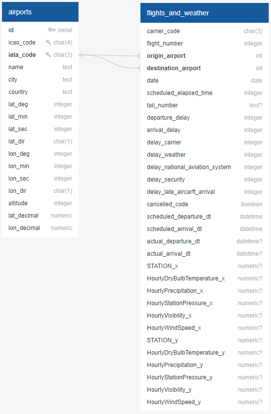

# Download and Prepare Datasets

There are two [Jupyter Notebook](https://jupyter.org/) files contained in this folder:
- `01_get_data.ipynb` is used to download the datasets
- `02_process_data.ipynb` is used to preprocess the data for eventual upload to a PostgreSQL database.

The data will be uploaded in two tables: `flights_and_weather` and `airports`, which will be joined on their [International Air Transport Association (IATA)](https://www.iata.org/) codes.

The database [Entity Relationship Diagram (ERD)](https://www.lucidchart.com/pages/er-diagrams), below, was created with [QuickDBD](https://www.quickdatabasediagrams.com/).



The diagram can be reproduced by entering the following into [its app](https://app.quickdatabasediagrams.com/):

```
airports as ap
----
id serial AUTOINCREMENT PK
icao_code char(4) UNIQUE
iata_code char(3) UNIQUE
name text
city text
country text
lat_deg integer
lat_min integer
lat_sec integer
lat_dir char(1)
lon_deg integer
lon_min integer
lon_sec integer
lon_dir char(1)
altitude integer
lat_decimal numeric
lon_decimal numeric

flights_and_weather as faw
----
carrier_code char(3)
flight_number integer
origin_airport FK >- ap.iata_code
destination_airport FK >- ap.iata_code
date date
scheduled_elapsed_time integer
tail_number text NULLABLE
departure_delay integer
arrival_delay integer
delay_carrier integer
delay_weather integer
delay_national_aviation_system integer
delay_security integer
delay_late_aircarft_arrival integer
cancelled_code boolean
scheduled_departure_dt datetime
scheduled_arrival_dt datetime
actual_departure_dt datetime NULLABLE
actual_arrival_dt datetime NULLABLE
STATION_x numeric NULLABLE
HourlyDryBulbTemperature_x numeric NULLABLE
HourlyPrecipitation_x numeric NULLABLE
HourlyStationPressure_x numeric NULLABLE
HourlyVisibility_x numeric NULLABLE
HourlyWindSpeed_x numeric NULLABLE
STATION_y numeric NULLABLE
HourlyDryBulbTemperature_y numeric NULLABLE
HourlyPrecipitation_y numeric NULLABLE
HourlyStationPressure_y numeric NULLABLE
HourlyVisibility_y numeric NULLABLE
HourlyWindSpeed_y numeric NULLABLE
```