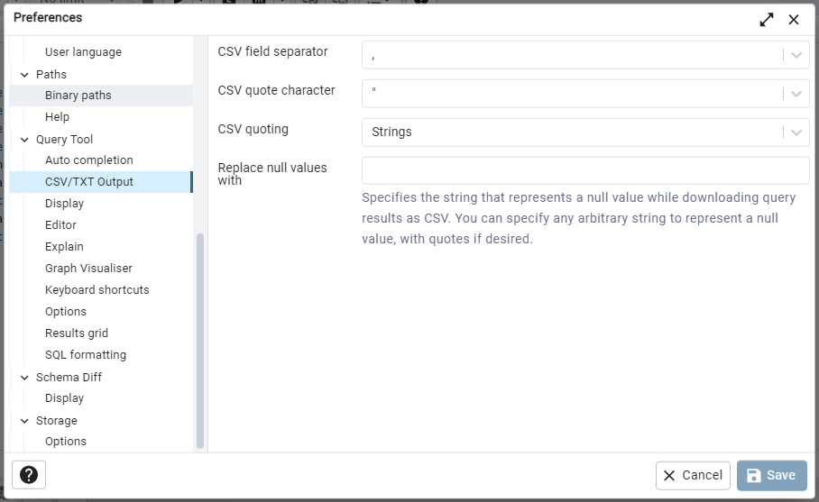

# Export Data to CSV

Once you have the data in your database, if you wish to export a CSV with all the flight-and-weather data with airport coordinates attached:

1. Locate or create a folder somewhere on your computer where you want to save the CSV file, and set permissions on that folder to explicitly **allow write permission to everyone**.
   - This is necessary so because the PostgreSQL server runs as its own user and can only write the file if it has permission.
2. Open pgAdmin.
3. Select any part of the `To_fly_or_not_to_fly` database in the tree-view browser on the left side.
   1. Enter your password, if needed.
4. If you haven't previously set your `Query Tool` `CSV/TXT Output` settings, open `File > Preferences` and make sure the settings match those in the image below.
   - 
5. Open the Query Tool by selecting `Tools > Query Tool (or by clicking on ).
6. Click on  (or type `Accesskey`+`o`) to activate the `Open File` dialog.
   1. Navigate to `/resources/sql/` and open the `export_combined_data.sql` file.
   2. The following code should appear in the Query Tool window:
      ```
      COPY (
          SELECT
              faw.*,
              orig.lat_decimal AS origin_lat,
              orig.lon_decimal AS origin_lon,
              dest.lat_decimal AS destination_lat,
              dest.lon_decimal AS destination_lon
          FROM flights_and_weather AS faw
              LEFT JOIN airports AS orig
              ON orig.iata_code = faw.origin_airport
              LEFT JOIN airports AS dest
              ON dest.iata_code = faw.destination_airport
      --     LIMIT 10
      ) TO 'FILEPATH'
      DELIMITER ','
      CSV HEADER
      ;
      ```
    - **Note:** you will have to replace the `FILEPATH` portion of the above query with the path to the folder from Step 1. (Make sure you include the filename as well.)
7. Execute the query by clicking  (or press `F5`).
   - Execution should not take more than a minute or so.

You can export other query results to CSV files as well: instead of opening the file from Step 6, above, paste the `COPY` template, below, into the Query Tool, and substitute your query text where indicated.
```
COPY (
    [Your query here]
) TO 'FILEPATH'
DELIMITER ','
CSV HEADER
;
```
(Remember to set the filename in your `FILEPATH` so as not to overwrite any CSVs you may have exported from earlier runs.)
